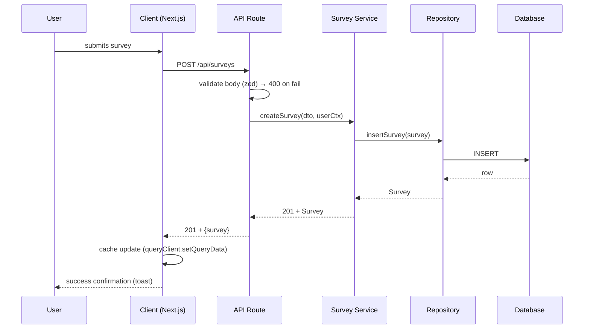

# User Flows & Request/Response Skill

## Purpose

AI builds screens. Users experience flows. This skill makes the AI think in
**journeys** first: what the user does, screen to screen, then what happens under the
hood — the request/response calls that power the trip. If you can't trace the flow,
you can't build the feature correctly.

## When to Use

- Before implementing any multi-step feature (auth, checkout, upload, settings, onboarding)
- When user describes "what happens when I do X?"
- When integrating with APIs — trace the actual network conversation

## Workflow

### Step 1 — Identify the Flow

From the sitemap + user's goal, name the flow (e.g., "User signs up", "User completes
a survey", "User deletes account"). One flow = one purpose.

### Step 2 — Draw the User Flow (Journey)

ASCII flowchart of screens + decisions + branches:

```
[Landing] --click Sign Up--> [Register]
   |                          |--submit--
   |                          v
   |                        [Verification] <--email link
   |                          |
   |                          v
   |                       [Setup profile] --skip?-->(optional)
   |                          |
   |                          v
   |                        [Dashboard] push /app/dashboard
   |                          |--sign out-->> [Landing]
```

Alternative branches, error branches, and loops are all marked. Every dead end gets a
recovery path.

### Step 3 — Produce the Request/Response Sequence (Mermaid)

For the critical paths within the flow, draw the network conversation:



Cover: happy path, validation failure, 401/403, 429 rate-limit, timeout, retry,
conflict (409). Every branch that can happen in prod appears in the diagram.

### Step 4 — Produce the Route Map

Tables connecting each screen → route → endpoint(s):

| Screen / Action | Route | Endpoint | Method | Notes |
|-----------------|-------|----------|--------|-------|
| Survey list | `/app/surveys` | `/api/surveys` | GET | paginated, cached |
| Create survey | `/app/surveys/new` | `/api/surveys` | POST | zod-validated body |
| Survey detail | `/app/surveys/:id` | `/api/surveys/:id` | GET | not-found if missing |
| Submit answers | survey detail | `/api/surveys/:id/submit` | POST | idempotent key on retry |

### Step 5 — Approve & Persist

1. Present the 3 artifacts (user flow, sequence, route map) to the user
2. Save into the feature spec (`docs/flows/<feature>.md`)
3. Keep in sync when implementation changes

## Rules

1. **Every user gesture has a continuation** — no dead ends.
2. **Every API call has all branches drawn** — success, 4xx, 5xx, timeout, offline.
3. **State is explicit** — loading/empty/error/success (cross-ref `States.md`).
4. **Optimistic vs pessimistic** — declare which and the rollback path.
5. **Idempotency on destructive/repeatable actions** — a retry doesn't double-charge/double-create.
6. **Auth implied** — authenticated calls carry token; failed auth handled (redirect to login).
7. **The flow comes BEFORE the screens** — never start coding a page without its flow.
8. **Only draw flows the product actually has.** If the product has no payments, there is
   no checkout flow. Don't design flows for features that don't exist.
9. **Keep each flow minimal.** One goal → main path → principal branches. Don't model
   every possible route through the app in a single diagram.

## Files in This Skill

```
user-flows/
├── SKILL.md              ← this file (entry point)
└── references/
    └── templates.md      ← ready-to-use flow templates (auth, checkout, CRUD, upload)
```

## Handoff

- The pages these flows traverse → `sitemap` skill
- Folder structure for the code → `folder-structure` skill
- Architecture of the modules involved → `design-patterns` skill
- Security of auth/upload flows → `ssdlc` skill