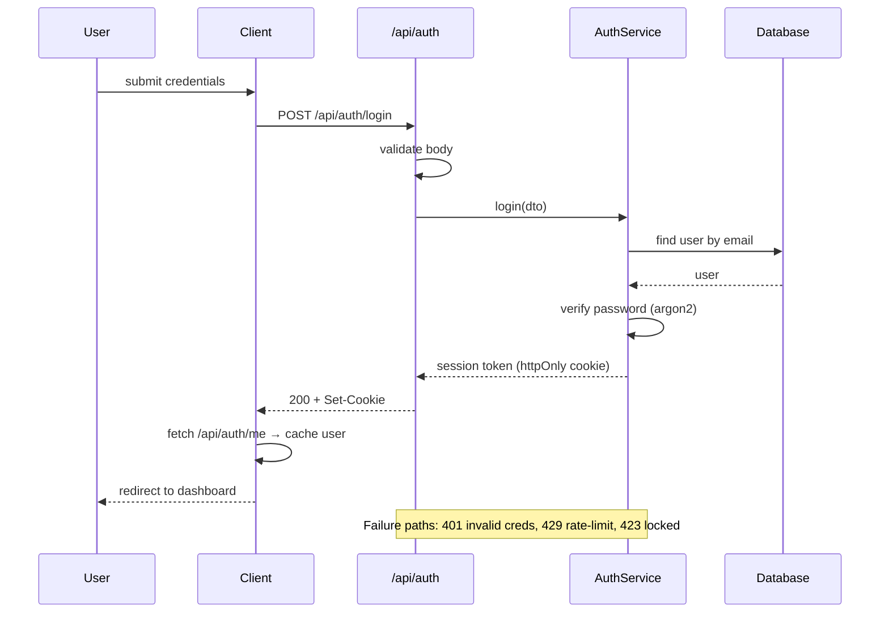
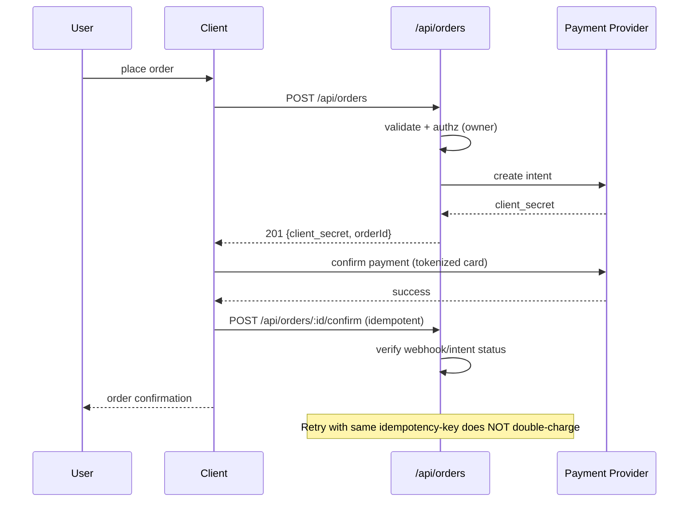

# Flow Templates — Ready to Adapt

Copy the applicable template, adapt names/endpoints to your feature, and expand all
branches (happy, error, retry, offline).

## Auth: Sign Up / Login



## Checkout / Payment



## CRUD: Resource List / Create / Update / Delete

| Screen | Route | Endpoint | Method |
|--------|-------|----------|--------|
| List | `/app/items` | `/api/items` | GET |
| Create | `/app/items/new` | `/api/items` | POST |
| View | `/app/items/:id` | `/api/items/:id` | GET |
| Edit | `/app/items/:id/edit` | `/api/items/:id` | PUT/PATCH |
| Delete | detail | `/api/items/:id` | DELETE |

REST rules: validate at boundary, repo isolates DB, after-mutation cache invalidation
(`queryClient.invalidateQueries(['items'])`), optimistic UI with rollback on failure.

## File Upload

```mermaid
sequenceDiagram
    participant U as User
    participant C as Client
    participant A as /api/uploads
    participant S as Storage (S3)

    U->>C: select file
    C->>C: client validation (type, size)
    C->>A: POST /api/uploads/presign {meta}
    A->>A: authz + quota check
    A-->>C: 200 {url, fields} (short-lived)
    C->>S: PUT file (direct to storage)
    S-->>C: 200
    C->>A: POST /api/uploads/complete {key}
    A->-S: verify object exists
    A-->>C: 201 file record
    C-->>U: success + preview
```

Add: quota exceeded, virus-scan pending, retry/resume, cleanup of orphaned uploads.

## Every Template's Universal Branches

For each flow, also draw/annotate:

- Validation failure (400) → inline field errors
- Unauthorized (401) → redirect to login, preserve intended route
- Forbidden (403) → permission screen
- Not found (404) → empty/recovery state, don't leak existence
- Rate limited (429) → backoff + retry
- Server error (500) → generic message + logged trace id
- Offline / timeout → retry with user-triggered retry button
- Conflict (409) → merge/reload or block with explanation