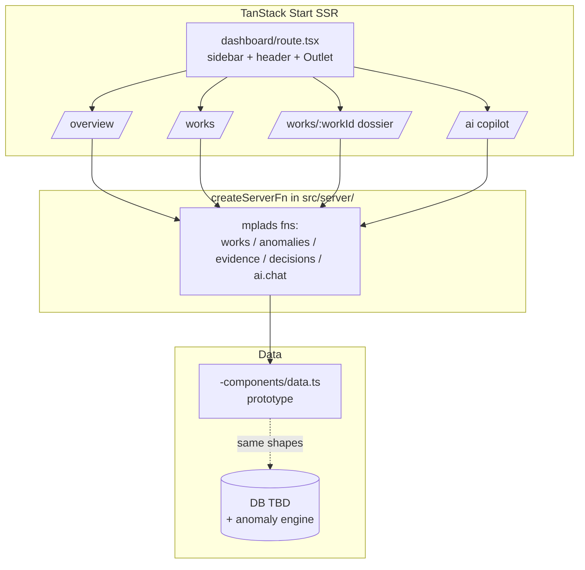
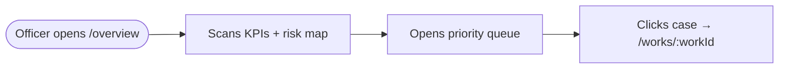
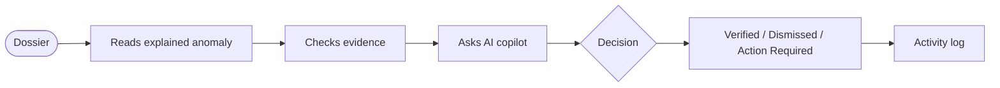
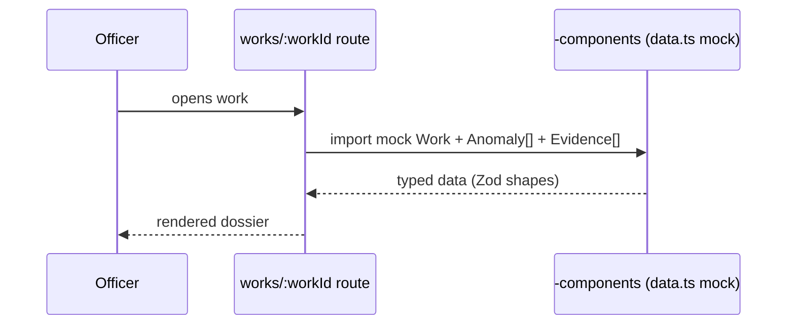
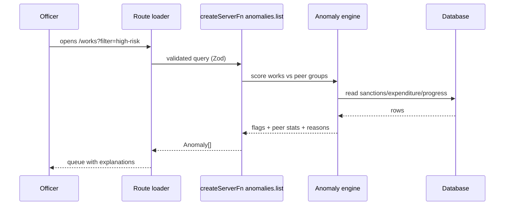

# Flow — MPLADS Sentinel (SIH26102)

> HOW the app works. Update when functions, components, routes, APIs, or flows change. Stale diagrams are bugs.

## Overview

An officer opens **Overview**, sees what needs attention, drills into the **Works** queue, opens a **Work dossier** (financials, progress, explained anomalies, evidence), asks the **AI copilot**, and records a **decision** (Verified / Dismissed / Action Required). Prototype runs on bundled mock data shaped like future server responses; backend/ML slots in behind identical signatures.

## Architecture diagram



## User flows

### Flow: Morning triage
**Goal**: know what needs attention today. **Steps**: Overview KPIs + risk map → high-priority queue → click top case → dossier.



### Flow: Investigation → decision
**Goal**: verify a flag and record the outcome. **Steps**: dossier tabs (financials/progress/anomalies/evidence) → AI question → set status + note → activity log entry.



### Flow: Evidence upload
**Goal**: attach supporting records to a work. **Steps**: dossier Evidence tab → upload (validated form) → file appears in grid/list → linked to anomaly context.

## Request / response flows

### Prototype (current): dossier load


### Target (backend built): anomaly-flagged works


## Function call map

### Dossier (to build)
```
/works/:workId (route.tsx, composes)
  ├─ <WorkSummary/>            (header: IDs, status badge, amounts)
  ├─ <FinancialsCard/>         (finance/ donor: KPI cards + recharts line)
  ├─ <ProgressCard/>           (meters + timeline)
  ├─ <AnomalyExplainer/>       (NEW: peer N, median vs actual, corroborating signal)
  ├─ <EvidenceGrid/>           (file-manager/ donor: grid/list + upload dialog)
  ├─ <ActivityTimeline/>       (invoice-style list)
  ├─ <DecisionBar/>            (Verified/Dismissed/Action Required + notes form)
  └─ <ContextualAI/>           (chat/ donor: bubble thread + tool cards)
```

### Overview (to build)
```
/overview (route.tsx, composes)
  ├─ <KpiStrip/>               (default/ donor: metric-cards)
  ├─ <IndiaRiskMap/>           (logistics/shipment-route-map donor + India TopoJSON TO ADD)
  └─ <PriorityQueue/>          (tasks/crm table donor: columns/schema/table, top-N)
```

### Works (to build)
```
/works (route.tsx, composes)
  └─ <WorksTable/>             (crm opportunities-table donor + tasks toolbar/filters)
       └─ row click → /works/:workId
```

## Route map

| Route | Source | Purpose |
|-------|--------|---------|
| `/auth/v1|v2/login|register` | template (reuse) | Officer sign-in |
| `/dashboard/default` etc. | template (donor only) | Reference screens — NOT in MVP nav |
| `/overview` | **to build** | KPIs + map + priority queue |
| `/works` | **to build** | Search/filter/sort works |
| `/works/:workId` | **to build** (`$param.tsx` pattern) | Dossier |
| `/ai` | **to build** on `(main)/chat/` | Global copilot |
| Sidebar nav | `navigation/sidebar/sidebar-items.ts` | Replace groups with MVP nav (Overview/Works/AI + dossier via click) |

## API endpoints (server functions)

| Function | Input (Zod) | Output | Today |
|----------|-------------|--------|-------|
| `works.list` | filters/search/sort/page | Work[] + total | mock `data.ts` |
| `works.get` | workId | Work detail | mock |
| `anomalies.list` | workId \| filters | Anomaly[] (+peer stats) | precomputed mock flags |
| `evidence.list/upload` | workId / file+meta | Evidence[] | local records |
| `decisions.record` | workId, status, note | Activity entry | in-memory |
| `ai.chat` | message + page context | answer + tool calls | to design (tool layer: getWork, comparePeers, explainFlag, searchWorks) |

## State flow

1. Route loaders/server fns return Zod-typed data (mock today, DB later — same shapes).
2. Dossier/AI conversation state: local component state first; promote to zustand store only when cross-route need is proven.
3. Preferences (theme/layout) persist via existing cookie-backed server fns — untouched.

## Update protocol (MANDATORY)

Update this file when any of the following change:

- [ ] New, renamed, or removed function / component / hook / route
- [ ] Call chain between functions changed
- [ ] New user flow or a change to an existing flow
- [ ] New or removed API endpoint
- [ ] New dependency in a call chain (library, service)
- [ ] State management approach changed
