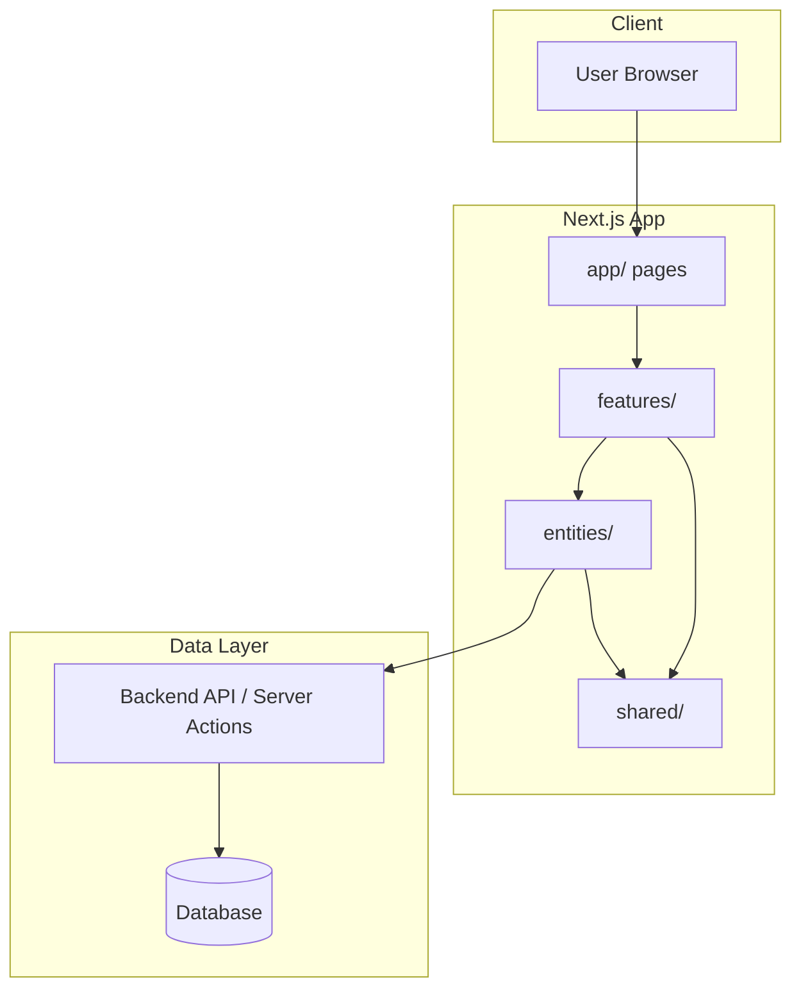
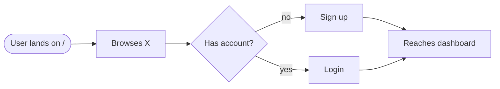
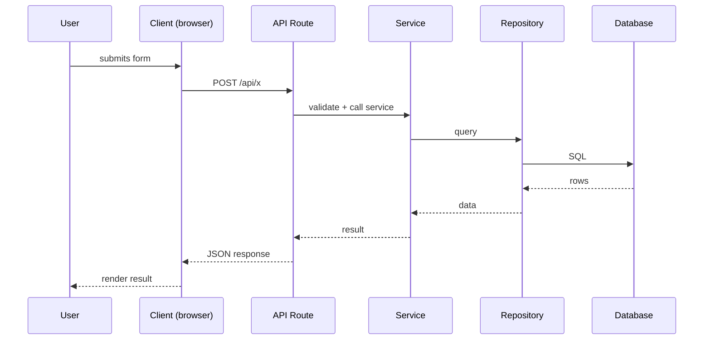

# Flow — Function Call Map & User Flows

> **Purpose**: The "how it works" file. It maps which functions call what, the user
> journeys, request/response sequences, and routes. Reading this file gives you an
> instant mental model of the project structure.
>
> **Update rule (MANDATORY)**: Update this file whenever you add, rename, or remove any
> function, component, hook, route, API endpoint, or user flow. Never let it go stale —
> agents and humans navigate the codebase through this file.

---

## Overview

[2–3 sentences: what the app does, the main loop, the key actors.]

---

## Architecture Diagram



---

## User Flows

> Each flow = one user journey. Format: goal → steps → outcome.

### Flow: [User flow name]
**Goal**: [what the user wants]
**Steps**: [brief description]



---

## Request / Response Flows

> One sequence diagram per key request. Use the Client → Route → Service → Repository →
> Database chain that matches the actual code.

### [Flow name]


---

## Function Call Map

> Which function calls what, per feature. Keep this accurate — agents use it to navigate
> the code and find where changes are needed.

### Feature: [feature name]
```
app/page.tsx (route composition)
  └─ <FeatureComponent />        (features/<feature>/components/)
       └─ use<Feature>Hook()     (features/<feature>/hooks/)
            └─ <feature>Service() (features/<feature>/service/)
                 └─ apiClient.get("/api/...")
```

### Feature: [feature name]
- `[Function A]` calls `[Function B]` to [why]
- `[Function B]` calls `[Repository X]` to [why]

---

## Route Map

| Route | Page / Handler | Purpose | Auth Required |
|-------|----------------|---------|---------------|
| `/` | `app/page.tsx` | Landing page | No |
| `/login` | `app/(auth)/login/page.tsx` | Sign in | No |

---

## API Endpoints

| Method | Path | Handler | Purpose |
|--------|------|---------|---------|
| POST | `/api/auth/login` | `authService.login` | Sign in and issue session |

---

## State Flow

> How state moves through the app (server → client → store). Describe the data flow,
> not just the components.

1. Server component fetches data in `app/` and passes props down
2. Client components call `<feature>Controller` for mutations
3. `queryClient` caches/invalidates on mutations

---

## Update Protocol (MANDATORY)

Update this file when any of the following change:

- [ ] New, renamed, or removed function / component / hook / route
- [ ] Call chain between functions changed
- [ ] New user flow or a change to an existing flow
- [ ] New or removed API endpoint
- [ ] New dependency in a call chain (library, service)
- [ ] State management approach changed

When you update, keep the diagrams in sync with the code — a stale diagram is worse than no diagram.
